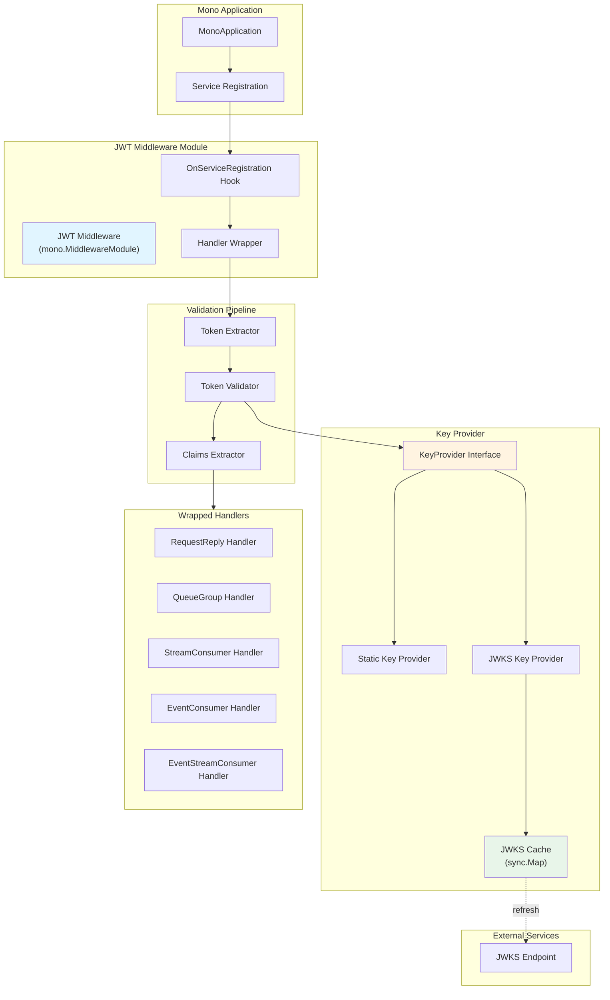

# JWT Middleware Design Document (Mono Framework)

## Overview

### Description

The **JWT middleware** is a contribution module for the Mono Framework that validates JWT tokens in NATS message headers. It implements the `mono.MiddlewareModule` interface and wraps all Mono handler types to enforce authentication before handler execution.

The middleware extracts JWT tokens from message headers, validates signatures and standard claims, and enriches the request context with validated claims for use in downstream handlers.

### Technology Stack

| Category | Technology | Rationale |
|----------|------------|-----------|
| **Language** | Go 1.21+ | Modern Go features, required by Mono framework |
| **Framework** | [Mono Framework](https://github.com/go-monolith/mono) | Distributed modular monolith with NATS |
| **JWT Library** | [golang-jwt/jwt/v5](https://github.com/golang-jwt/jwt) | Well-maintained, supports all algorithms |
| **HTTP Client** | `net/http` (stdlib) | For JWKS fetching |
| **Caching** | `sync.Map` | Concurrent-safe in-memory cache for JWKS |
| **Logging** | `log/slog` (stdlib) | Structured logging via Mono framework |

---

## High-Level Architecture

### Architecture Description

The JWT middleware follows the **Mono MiddlewareModule pattern** with these key layers:

1. **Middleware Module Layer**: Implements `mono.MiddlewareModule` interface for lifecycle and registration
2. **Handler Wrapping Layer**: Wraps all 5 Mono handler types with JWT validation
3. **Validation Layer**: JWT parsing, signature verification, claims extraction
4. **Key Provider Layer**: Abstracts static key vs JWKS key resolution
5. **Caching Layer**: Thread-safe in-memory cache for JWKS keys

### Architecture Diagram



---

## Component Design

### Component Overview

| Component | Responsibility | Implements |
|-----------|----------------|------------|
| `Middleware` | Main middleware module | `mono.MiddlewareModule` |
| `TokenExtractor` | Extract JWT from message header | Internal function |
| `TokenValidator` | Validate JWT signature and claims | Struct with methods |
| `KeyProvider` | Abstract key resolution | Interface |
| `StaticKeyProvider` | Provide static keys | `KeyProvider` |
| `JWKSKeyProvider` | Fetch and cache JWKS keys | `KeyProvider` |
| `JWKSCache` | Thread-safe JWKS cache | Struct with `sync.Map` |
| `ClaimsExtractor` | Extract claims from validated JWT | Internal function |

---

## Key Interfaces and Data Models

### Configuration

```go
// Config holds JWT middleware configuration
type Config struct {
    // Key source options (mutually exclusive)
    Secret       []byte            // For HMAC algorithms (HS256, HS384, HS512)
    PublicKey    crypto.PublicKey  // For RSA/ECDSA algorithms
    JWKSEndpoint string            // URL for JWKS endpoint

    // JWKS cache settings
    JWKSCacheTTL        time.Duration // Default: 1 hour
    JWKSRefreshInterval time.Duration // Default: 50 minutes (proactive refresh)
    JWKSRequestTimeout  time.Duration // Default: 10 seconds

    // Validation options
    RequiredClaims   []string   // Claims that must be present
    ExpectedIssuer   string     // Expected 'iss' claim
    ExpectedAudience []string   // Expected 'aud' claim(s)
    AllowedAlgorithms []string  // Whitelist of allowed algorithms
    ClockSkew        time.Duration // Default: 1 minute

    // Header settings
    HeaderKey    string // Default: "authorization"
    TokenPrefix  string // Default: "Bearer "

    // Behavior settings
    SkipPaths []string // Service paths to skip validation (e.g., "health.check")
    Optional  bool     // If true, allow messages without tokens
}

// Functional options
func WithSecret(secret []byte) Option
func WithPublicKey(publicKey crypto.PublicKey) Option
func WithJWKSEndpoint(endpoint string) Option
func WithJWKSCacheTTL(ttl time.Duration) Option
func WithExpectedIssuer(issuer string) Option
func WithExpectedAudience(audience ...string) Option
func WithRequiredClaims(claims ...string) Option
func WithAllowedAlgorithms(algorithms ...string) Option
func WithSkipPaths(paths ...string) Option
func WithOptional(optional bool) Option
```

### Middleware Module

```go
// Middleware implements mono.MiddlewareModule
type Middleware struct {
    name      string
    config    *Config
    validator *TokenValidator
    jwksCache *JWKSCache // nil if using static keys
    logger    *slog.Logger

    // Background refresh
    refreshCtx    context.Context
    refreshCancel context.CancelFunc
}

// Mono MiddlewareModule interface methods
func (m *Middleware) Name() string
func (m *Middleware) Start(ctx context.Context) error
func (m *Middleware) Stop(ctx context.Context) error
func (m *Middleware) OnServiceRegistration(ctx context.Context, reg types.ServiceRegistration) types.ServiceRegistration
func (m *Middleware) Logger() *slog.Logger

// Additional lifecycle hooks (return unchanged if not applicable)
func (m *Middleware) OnModuleLifecycle(ctx context.Context, event types.ModuleLifecycleEvent) types.ModuleLifecycleEvent
func (m *Middleware) OnOutgoingMessage(ctx context.Context, msg *types.Msg) *types.Msg
```

### Key Provider Interface

```go
// KeyProvider abstracts key resolution for JWT signature verification
type KeyProvider interface {
    // GetKey returns the public key or secret for verifying the JWT
    // kid is the Key ID from JWT header (may be empty for static key mode)
    GetKey(ctx context.Context, kid string) (interface{}, error)
}
```

### Context Keys and Helpers

```go
// Unexported context key type for type safety
type claimsContextKey struct{}

// WithClaims adds JWT claims to context
func WithClaims(ctx context.Context, claims jwt.MapClaims) context.Context

// ClaimsFromContext retrieves JWT claims from context
func ClaimsFromContext(ctx context.Context) (jwt.MapClaims, bool)

// MustClaimsFromContext retrieves claims or panics
func MustClaimsFromContext(ctx context.Context) jwt.MapClaims

// SubjectFromContext is a convenience function to get the 'sub' claim
func SubjectFromContext(ctx context.Context) (string, bool)

// IssuerFromContext is a convenience function to get the 'iss' claim
func IssuerFromContext(ctx context.Context) (string, bool)
```

---

## Component Details

### 1. Middleware Module Implementation

**Purpose:** Main middleware module implementing `mono.MiddlewareModule` interface.

**Initialization:**

```go
func New(opts ...Option) (*Middleware, error) {
    // Default configuration
    cfg := &Config{
        JWKSCacheTTL:       1 * time.Hour,
        JWKSRefreshInterval: 50 * time.Minute,
        JWKSRequestTimeout: 10 * time.Second,
        ClockSkew:          1 * time.Minute,
        HeaderKey:          "authorization",
        TokenPrefix:        "Bearer ",
    }

    // Apply options
    for _, opt := range opts {
        opt(cfg)
    }

    // Validate configuration
    if err := validateConfig(cfg); err != nil {
        return nil, err
    }

    // Choose key provider based on configuration
    var keyProvider KeyProvider
    var jwksCache *JWKSCache

    if cfg.JWKSEndpoint != "" {
        jwksCache = NewJWKSCache(cfg.JWKSCacheTTL)
        keyProvider = NewJWKSKeyProvider(cfg.JWKSEndpoint, jwksCache, cfg.JWKSRequestTimeout)
    } else if cfg.PublicKey != nil {
        keyProvider = NewStaticKeyProvider(cfg.PublicKey)
    } else if cfg.Secret != nil {
        keyProvider = NewStaticKeyProvider(cfg.Secret)
    } else {
        return nil, errors.New("no key source configured")
    }

    // Initialize validator
    validator := NewTokenValidator(keyProvider, cfg)

    return &Middleware{
        name:      "jwt",
        config:    cfg,
        validator: validator,
        jwksCache: jwksCache,
    }, nil
}

func (m *Middleware) Name() string {
    return m.name
}

func (m *Middleware) Logger() *slog.Logger {
    return m.logger
}

func (m *Middleware) Start(ctx context.Context) error {
    // If using JWKS, perform initial fetch
    if m.jwksCache != nil {
        provider := m.validator.keyProvider.(*JWKSKeyProvider)
        if err := provider.RefreshCache(ctx); err != nil {
            return fmt.Errorf("failed to fetch JWKS on startup: %w", err)
        }

        // Start background refresh if configured
        if m.config.JWKSRefreshInterval > 0 {
            m.refreshCtx, m.refreshCancel = context.WithCancel(context.Background())
            go m.backgroundRefresh()
        }
    }

    m.logger.Info("JWT middleware started", "mode", m.getMode())
    return nil
}

func (m *Middleware) Stop(ctx context.Context) error {
    // Cancel background refresh
    if m.refreshCancel != nil {
        m.refreshCancel()
    }

    m.logger.Info("JWT middleware stopped")
    return nil
}

func (m *Middleware) backgroundRefresh() {
    ticker := time.NewTicker(m.config.JWKSRefreshInterval)
    defer ticker.Stop()

    for {
        select {
        case <-m.refreshCtx.Done():
            return
        case <-ticker.C:
            provider := m.validator.keyProvider.(*JWKSKeyProvider)
            if err := provider.RefreshCache(context.Background()); err != nil {
                m.logger.Warn("background JWKS refresh failed", "error", err)
            } else {
                m.logger.Debug("background JWKS refresh succeeded")
            }
        }
    }
}

func (m *Middleware) getMode() string {
    if m.config.JWKSEndpoint != "" {
        return "jwks"
    } else if m.config.PublicKey != nil {
        return "public_key"
    } else {
        return "secret"
    }
}
```

---

### 2. OnServiceRegistration Hook (Handler Wrapping)

**Purpose:** Wrap all handler types with JWT validation.

**Implementation:**

```go
func (m *Middleware) OnServiceRegistration(
    ctx context.Context,
    reg types.ServiceRegistration,
) types.ServiceRegistration {
    // Check if this service should be skipped
    if m.shouldSkip(reg.ModuleName, reg.ServiceName) {
        return reg
    }

    // Wrap each handler type
    if reg.RequestReplyHandler != nil {
        reg.RequestReplyHandler = m.wrapRequestReplyHandler(
            reg.RequestReplyHandler,
            reg.ModuleName,
            reg.ServiceName,
        )
    }

    if reg.QueueGroupHandler != nil {
        reg.QueueGroupHandler = m.wrapQueueGroupHandler(
            reg.QueueGroupHandler,
            reg.ModuleName,
            reg.ServiceName,
        )
    }

    if reg.StreamConsumerHandler != nil {
        reg.StreamConsumerHandler = m.wrapStreamConsumerHandler(
            reg.StreamConsumerHandler,
            reg.ModuleName,
            reg.ServiceName,
        )
    }

    if reg.EventConsumerHandler != nil {
        reg.EventConsumerHandler = m.wrapEventConsumerHandler(
            reg.EventConsumerHandler,
            reg.ModuleName,
            reg.ServiceName,
        )
    }

    if reg.EventStreamConsumerHandler != nil {
        reg.EventStreamConsumerHandler = m.wrapEventStreamConsumerHandler(
            reg.EventStreamConsumerHandler,
            reg.ModuleName,
            reg.ServiceName,
        )
    }

    return reg
}

func (m *Middleware) shouldSkip(moduleName, serviceName string) bool {
    fullPath := fmt.Sprintf("%s.%s", moduleName, serviceName)
    for _, skip := range m.config.SkipPaths {
        if skip == fullPath || skip == moduleName || skip == serviceName {
            return true
        }
    }
    return false
}
```

---

### 3. Handler Wrapping Functions

**Purpose:** Wrap each handler type with JWT validation logic.

**RequestReply Handler Example:**

```go
func (m *Middleware) wrapRequestReplyHandler(
    original types.RequestReplyHandler,
    moduleName, serviceName string,
) types.RequestReplyHandler {
    return func(ctx context.Context, msg *types.Msg) ([]byte, error) {
        // Extract token from message header
        token, err := m.extractToken(msg.Header)
        if err != nil {
            if m.config.Optional {
                // Allow request without token
                return original(ctx, msg)
            }
            m.logger.Warn("token extraction failed",
                "module", moduleName,
                "service", serviceName,
                "error", err,
            )
            return nil, err
        }

        // Validate JWT and extract claims
        claims, err := m.validator.Validate(ctx, token)
        if err != nil {
            m.logger.Warn("token validation failed",
                "module", moduleName,
                "service", serviceName,
                "error", err,
            )
            return nil, err
        }

        // Add claims to context
        ctx = WithClaims(ctx, claims)

        m.logger.Debug("JWT validated successfully",
            "module", moduleName,
            "service", serviceName,
            "subject", claims["sub"],
        )

        // Call original handler with enhanced context
        return original(ctx, msg)
    }
}
```

**Other Handler Wrappers:** Similar pattern for `QueueGroup`, `StreamConsumer`, `EventConsumer`, and `EventStreamConsumer`.

---

### 4. Token Extractor

**Purpose:** Extract JWT from message header with case-insensitive lookup.

**Implementation:**

```go
func (m *Middleware) extractToken(headers map[string][]string) (string, error) {
    // Case-insensitive header lookup
    var authHeader string
    for key, values := range headers {
        if strings.ToLower(key) == strings.ToLower(m.config.HeaderKey) {
            if len(values) > 0 {
                authHeader = values[0]
                break
            }
        }
    }

    if authHeader == "" {
        return "", ErrMissingAuthHeader
    }

    // Check for Bearer prefix (case-insensitive)
    prefix := m.config.TokenPrefix
    if !strings.HasPrefix(strings.ToLower(authHeader), strings.ToLower(prefix)) {
        return "", ErrInvalidAuthHeader
    }

    // Extract token part
    token := strings.TrimSpace(authHeader[len(prefix):])
    if token == "" {
        return "", ErrInvalidAuthHeader
    }

    return token, nil
}
```

---

### 5. Token Validator

**Purpose:** Validate JWT signature, expiration, and claims.

**Implementation:**

```go
type TokenValidator struct {
    keyProvider KeyProvider
    config      *Config
}

func NewTokenValidator(keyProvider KeyProvider, config *Config) *TokenValidator {
    return &TokenValidator{
        keyProvider: keyProvider,
        config:      config,
    }
}

func (v *TokenValidator) Validate(ctx context.Context, tokenString string) (jwt.MapClaims, error) {
    // Parse JWT with key function
    token, err := jwt.Parse(tokenString, func(token *jwt.Token) (interface{}, error) {
        // Verify algorithm is allowed
        alg := token.Header["alg"].(string)
        if !v.isAlgorithmAllowed(alg) {
            return nil, fmt.Errorf("unsupported algorithm: %s", alg)
        }

        // Get kid from header
        kid, _ := token.Header["kid"].(string)

        // Get key from provider
        return v.keyProvider.GetKey(ctx, kid)
    })

    if err != nil {
        return nil, fmt.Errorf("token parsing failed: %w", err)
    }

    if !token.Valid {
        return nil, ErrInvalidToken
    }

    // Extract claims
    claims, ok := token.Claims.(jwt.MapClaims)
    if !ok {
        return nil, ErrInvalidClaims
    }

    // Validate standard claims with clock skew
    if err := v.validateStandardClaims(claims); err != nil {
        return nil, err
    }

    // Validate issuer
    if err := v.validateIssuer(claims); err != nil {
        return nil, err
    }

    // Validate audience
    if err := v.validateAudience(claims); err != nil {
        return nil, err
    }

    // Validate required claims
    if err := v.validateRequiredClaims(claims); err != nil {
        return nil, err
    }

    return claims, nil
}

func (v *TokenValidator) validateStandardClaims(claims jwt.MapClaims) error {
    now := time.Now()
    skew := v.config.ClockSkew

    // Validate exp (expiration)
    if exp, ok := claims["exp"].(float64); ok {
        expTime := time.Unix(int64(exp), 0)
        if now.After(expTime.Add(skew)) {
            return ErrTokenExpired
        }
    }

    // Validate nbf (not before)
    if nbf, ok := claims["nbf"].(float64); ok {
        nbfTime := time.Unix(int64(nbf), 0)
        if now.Before(nbfTime.Add(-skew)) {
            return ErrTokenNotYetValid
        }
    }

    // Validate iat (issued at)
    if iat, ok := claims["iat"].(float64); ok {
        iatTime := time.Unix(int64(iat), 0)
        if now.Before(iatTime.Add(-skew)) {
            return ErrInvalidIssuedAt
        }
    }

    return nil
}

func (v *TokenValidator) validateIssuer(claims jwt.MapClaims) error {
    if v.config.ExpectedIssuer == "" {
        return nil
    }

    iss, ok := claims["iss"].(string)
    if !ok || iss != v.config.ExpectedIssuer {
        return ErrInvalidIssuer
    }

    return nil
}

func (v *TokenValidator) validateAudience(claims jwt.MapClaims) error {
    if len(v.config.ExpectedAudience) == 0 {
        return nil
    }

    // aud can be string or []string
    aud, ok := claims["aud"]
    if !ok {
        return ErrInvalidAudience
    }

    var audiences []string
    switch v := aud.(type) {
    case string:
        audiences = []string{v}
    case []interface{}:
        for _, a := range v {
            if s, ok := a.(string); ok {
                audiences = append(audiences, s)
            }
        }
    default:
        return ErrInvalidAudience
    }

    // Check if any expected audience matches
    for _, expected := range v.config.ExpectedAudience {
        for _, actual := range audiences {
            if actual == expected {
                return nil
            }
        }
    }

    return ErrInvalidAudience
}

func (v *TokenValidator) validateRequiredClaims(claims jwt.MapClaims) error {
    for _, required := range v.config.RequiredClaims {
        value, exists := claims[required]
        if !exists || value == nil || value == "" {
            return fmt.Errorf("missing required claim: %s", required)
        }
    }
    return nil
}

func (v *TokenValidator) isAlgorithmAllowed(alg string) bool {
    if len(v.config.AllowedAlgorithms) == 0 {
        return true // Allow all if not configured
    }

    for _, allowed := range v.config.AllowedAlgorithms {
        if alg == allowed {
            return true
        }
    }

    return false
}
```

---

### 6. Static Key Provider

**Purpose:** Provide static secret or public key for signature verification.

**Implementation:**

```go
type StaticKeyProvider struct {
    key interface{} // []byte for HMAC, crypto.PublicKey for RSA/ECDSA
}

func NewStaticKeyProvider(key interface{}) *StaticKeyProvider {
    return &StaticKeyProvider{key: key}
}

func (p *StaticKeyProvider) GetKey(ctx context.Context, kid string) (interface{}, error) {
    // Static key mode ignores kid
    return p.key, nil
}
```

---

### 7. JWKS Key Provider and Cache

**Purpose:** Fetch and cache JWKS keys with background refresh.

**Implementation:**

```go
type JWKSCache struct {
    keys      sync.Map     // kid -> crypto.PublicKey
    lastFetch time.Time
    ttl       time.Duration
    mu        sync.RWMutex
}

func NewJWKSCache(ttl time.Duration) *JWKSCache {
    return &JWKSCache{
        ttl: ttl,
    }
}

func (c *JWKSCache) Get(kid string) (interface{}, bool) {
    c.mu.RLock()
    defer c.mu.RUnlock()

    // Check if cache is stale
    if time.Since(c.lastFetch) > c.ttl {
        return nil, false
    }

    key, ok := c.keys.Load(kid)
    return key, ok
}

func (c *JWKSCache) Set(kid string, key interface{}) {
    c.keys.Store(kid, key)
}

func (c *JWKSCache) UpdateLastFetch() {
    c.mu.Lock()
    defer c.mu.Unlock()
    c.lastFetch = time.Now()
}

type JWKSKeyProvider struct {
    endpoint   string
    cache      *JWKSCache
    httpClient *http.Client
    refreshMu  sync.Mutex // Prevent concurrent refreshes
}

func NewJWKSKeyProvider(endpoint string, cache *JWKSCache, timeout time.Duration) *JWKSKeyProvider {
    return &JWKSKeyProvider{
        endpoint: endpoint,
        cache:    cache,
        httpClient: &http.Client{
            Timeout: timeout,
        },
    }
}

func (p *JWKSKeyProvider) GetKey(ctx context.Context, kid string) (interface{}, error) {
    // Try cache first
    key, found := p.cache.Get(kid)
    if found {
        return key, nil
    }

    // Cache miss - refresh JWKS
    if err := p.RefreshCache(ctx); err != nil {
        return nil, fmt.Errorf("failed to refresh JWKS: %w", err)
    }

    // Retry from cache
    key, found = p.cache.Get(kid)
    if !found {
        return nil, fmt.Errorf("key not found: kid=%s", kid)
    }

    return key, nil
}

func (p *JWKSKeyProvider) RefreshCache(ctx context.Context) error {
    // Prevent concurrent refreshes
    p.refreshMu.Lock()
    defer p.refreshMu.Unlock()

    // Fetch JWKS
    req, err := http.NewRequestWithContext(ctx, "GET", p.endpoint, nil)
    if err != nil {
        return err
    }

    resp, err := p.httpClient.Do(req)
    if err != nil {
        return err
    }
    defer resp.Body.Close()

    if resp.StatusCode != http.StatusOK {
        return fmt.Errorf("JWKS endpoint returned %d", resp.StatusCode)
    }

    // Parse JWKS
    var jwks struct {
        Keys []json.RawMessage `json:"keys"`
    }
    if err := json.NewDecoder(resp.Body).Decode(&jwks); err != nil {
        return err
    }

    // Parse each key and update cache
    // (Use github.com/lestrrat-go/jwx/v2/jwk for actual parsing)
    for _, keyData := range jwks.Keys {
        // Simplified - actual implementation would parse JWK properly
        // key, err := jwk.ParseKey(keyData)
        // p.cache.Set(key.KeyID(), key.PublicKey())
    }

    p.cache.UpdateLastFetch()
    return nil
}
```

---

## Usage Examples

### Example 1: Static Secret (HMAC)

```go
package main

import (
    "github.com/go-monolith/mono"
    "github.com/go-monolith/contrib/v1/jwt"
)

func main() {
    app := mono.NewMonoApplication()

    // Create JWT middleware with HMAC secret
    jwtMw, err := jwt.New(
        jwt.WithSecret([]byte("your-256-bit-secret")),
        jwt.WithExpectedIssuer("https://your-issuer.com"),
        jwt.WithRequiredClaims("sub", "org"),
    )
    if err != nil {
        log.Fatal(err)
    }

    app.Register(jwtMw)
    app.Register(myModule)

    app.Run()
}
```

### Example 2: Static Public Key (RSA)

```go
import (
    "crypto/rsa"
    "github.com/go-monolith/contrib/v1/jwt"
)

func main() {
    // Load RSA public key from PEM
    publicKey, _ := jwt.ParseRSAPublicKeyFromPEM(pemData)

    jwtMw, err := jwt.New(
        jwt.WithPublicKey(publicKey),
        jwt.WithAllowedAlgorithms([]string{"RS256", "RS384", "RS512"}),
    )
    if err != nil {
        log.Fatal(err)
    }

    app.Register(jwtMw)
}
```

### Example 3: JWKS Endpoint

```go
func main() {
    jwtMw, err := jwt.New(
        jwt.WithJWKSEndpoint("https://auth.example.com/.well-known/jwks.json"),
        jwt.WithJWKSCacheTTL(2 * time.Hour),
        jwt.WithJWKSRefreshInterval(90 * time.Minute),
    )
    if err != nil {
        log.Fatal(err)
    }

    app.Register(jwtMw)
}
```

### Example 4: Accessing Claims in Handler

```go
func (m *MyModule) HandleRequest(ctx context.Context, msg *types.Msg) ([]byte, error) {
    // Get all claims
    claims, ok := jwt.ClaimsFromContext(ctx)
    if !ok {
        return nil, errors.New("no claims in context")
    }

    // Get specific claims
    userID := claims["sub"].(string)
    org := claims["org"].(string)
    role, _ := claims["role"].(string)

    // Or use helpers
    subject, ok := jwt.SubjectFromContext(ctx)

    // Use claims for authorization
    if role != "admin" {
        return nil, errors.New("unauthorized")
    }

    // Process request with claims
    return processRequest(userID, org)
}
```

### Example 5: Skip Paths

```go
jwtMw, err := jwt.New(
    jwt.WithJWKSEndpoint("..."),
    jwt.WithSkipPaths("health.check", "metrics.get"),
)
```

---

## Error Types

```go
var (
    ErrMissingAuthHeader  = errors.New("missing authorization header")
    ErrInvalidAuthHeader  = errors.New("invalid authorization header format")
    ErrInvalidToken       = errors.New("invalid token")
    ErrTokenExpired       = errors.New("token expired")
    ErrTokenNotYetValid   = errors.New("token not yet valid")
    ErrInvalidSignature   = errors.New("invalid token signature")
    ErrInvalidIssuer      = errors.New("invalid issuer")
    ErrInvalidAudience    = errors.New("invalid audience")
    ErrInvalidIssuedAt    = errors.New("invalid issued at time")
    ErrInvalidClaims      = errors.New("invalid claims format")
    ErrMissingRequiredClaim = errors.New("missing required claim")
    ErrJWKSFetchFailed    = errors.New("failed to fetch JWKS")
)
```

---

## Testing Strategy

### Unit Tests

- Token extraction (valid/invalid headers)
- Token validation (signature, expiration, claims)
- Static key provider
- JWKS cache operations (get/set/expiry)
- Claims context helpers

### Integration Tests

- Handler wrapping for all 5 handler types
- End-to-end validation with real Mono app
- JWKS endpoint integration (with mock server)

### Performance Tests

- Benchmark validation latency (static keys: <10ms, JWKS: <20ms)
- Benchmark concurrent validations
- Race detector tests

---

## Success Criteria

| Category | Metric | Target |
|----------|--------|--------|
| **Performance** | Validation latency (p95) | <10ms (static), <20ms (JWKS) |
| **Reliability** | JWKS cache hit rate | >95% |
| **Security** | Algorithm verification | 100% (no false positives) |
| **Compatibility** | Mono framework integration | Seamless with all handler types |

---

*Last Updated: January 2026*
*Version: 1.0 (MVP Scope)*
